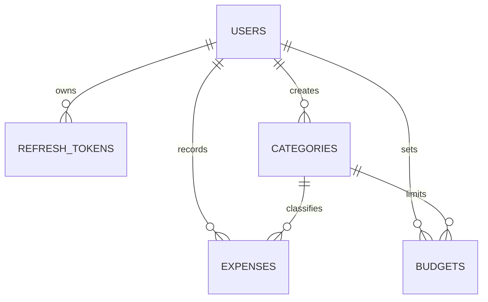

# Secure Expense Tracker API

A portfolio-ready Spring Boot REST API for private expense tracking, monthly category budgets, and spending reports. It
demonstrates secure token rotation, tenant isolation, PostgreSQL migrations, role-based administration, Docker delivery,
OpenAPI documentation, and automated verification.

## Stack

- Java 21, Spring Boot 3.5, Gradle 8.14
- Spring Security with HS256 JWT access tokens and rotating opaque refresh tokens
- PostgreSQL 18, Spring Data JPA, Flyway
- OpenAPI 3 and Swagger UI
- JUnit 5, Spring Security Test, Testcontainers, JaCoCo
- Docker Compose and GitHub Actions

## Architecture and security

The application is a package-by-feature monolith. Controllers accept validated records, services own transactions and
business rules, repositories enforce user-scoped access, and entities never cross the API boundary.

- Access tokens expire after 15 minutes. Refresh tokens expire after 30 days, are stored only as SHA-256 hashes, rotate
  on use, and revoke their entire family when reuse is detected.
- Public registration always creates a `USER`. An `ADMIN` is bootstrapped only when both admin environment variables are
  set.
- Admins can manage account status and global categories. They cannot inspect or mutate private expenses or budgets.
- A user's currency is fixed at registration; the API does not perform exchange-rate conversion.
- Referenced categories are archived, preserving historical reports.



## Run with Docker

1. Copy `.env.example` to `.env`.
2. Replace every placeholder password and generate a JWT secret containing at least 32 random bytes.
3. Run `docker compose up --build`.

Health: `http://localhost:8080/actuator/health`

Swagger UI: `http://localhost:8080/swagger-ui.html`

To run from Gradle, start PostgreSQL and export `DB_URL`, `DB_USERNAME`, `DB_PASSWORD`, and `JWT_SECRET`, then run
`./gradlew bootRun` (`gradlew.bat bootRun` on Windows).

## API overview

| Area | Endpoint | Access |
|---|---|---|
| Auth | `POST /api/v1/auth/register`, `/login`, `/refresh`, `/logout` | Public |
| Profile | `GET /api/v1/users/me` | User/Admin |
| Expenses | CRUD `/api/v1/expenses` | Owner only |
| Categories | `/api/v1/categories` | Visible globals and owner's categories |
| Budgets | `/api/v1/budgets` | Owner only |
| Reports | `GET /api/v1/reports/monthly/{year}/{month}` | Owner only |
| Users | `/api/v1/admin/users` | Admin |
| Global categories | `/api/v1/admin/categories` | Admin |

### Minimal demo flow

Register:

```bash
curl -X POST http://localhost:8080/api/v1/auth/register \
  -H "Content-Type: application/json" \
  -d '{"email":"demo@example.com","password":"correct-horse-battery","displayName":"Demo User","currency":"USD"}'
```

Copy the returned access token, then discover seeded category IDs:

```bash
curl http://localhost:8080/api/v1/categories \
  -H "Authorization: Bearer ACCESS_TOKEN"
```

Create an expense, a budget, and fetch the report:

```bash
curl -X POST http://localhost:8080/api/v1/expenses \
  -H "Authorization: Bearer ACCESS_TOKEN" -H "Content-Type: application/json" \
  -d '{"categoryId":"CATEGORY_ID","amount":42.50,"expenseDate":"2026-09-14","description":"Weekly groceries"}'

curl -X PUT http://localhost:8080/api/v1/budgets/2026/9/categories/CATEGORY_ID \
  -H "Authorization: Bearer ACCESS_TOKEN" -H "Content-Type: application/json" \
  -d '{"amount":200.00}'

curl http://localhost:8080/api/v1/reports/monthly/2026/9 \
  -H "Authorization: Bearer ACCESS_TOKEN"
```

## Configuration

| Variable                               | Required | Purpose |
|----------------------------------------|---:|---|
| `DB_URL`, `DB_USERNAME`, `DB_PASSWORD` | Yes outside Compose defaults | PostgreSQL connection |
| `JWT_SECRET`                           | Yes | HS256 key, at least 32 bytes |
| `JWT_ISSUER`, `JWT_AUDIENCE`           | No | Token validation boundaries |
| `JWT_ACCESS_TTL`, `JWT_REFRESH_TTL`    | No | Defaults to `15m` and `30d` |
| `CORS_ALLOWED_ORIGINS`                 | No | Comma-separated browser origins |
| `ADMIN_EMAIL`, `ADMIN_PASSWORD`        | No, paired | Idempotent initial admin bootstrap |
| `ADMIN_DISPLAY_NAME`, `ADMIN_CURRENCY` | No | Bootstrap admin profile |

Never commit `.env` or real credentials.

## Tests and quality gate

Docker must be available for Testcontainers integration tests.

```bash
./gradlew clean check
```

`check` runs unit and integration tests and enforces at least 85% line and 75% branch coverage over application logic.
The HTML report is written to `build/reports/jacoco/test/html/index.html`.
